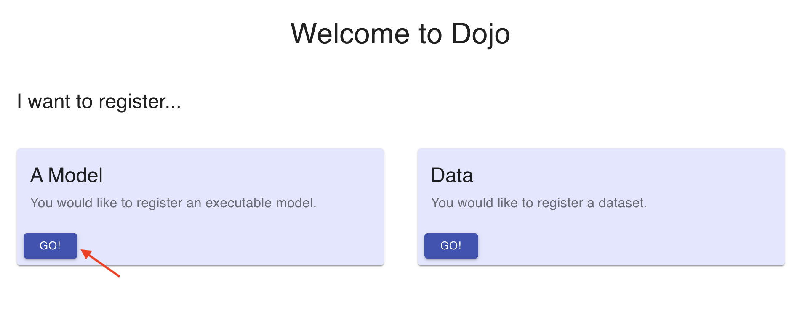

## Model Registration

### Contents

1. [Getting Started](#getting-started)
2. [Documenting the Model](#documenting-the-model)
3. [Directive Annotation](#directive-annotation)
4. [Configuration File Annotation](#configuration-file-annotation)
5. Output File Annotation (coming soon)

### Getting Started

You may begin by navigating to [https://phantom.dojo-test.com](https://phantom.dojo-test.com/). Please reach out to [dojo@jataware.com](mailto:dojo@jataware.com) for credentials or help with the application. Once you have accessed Dojo, on the opening screen select `Go!` under `A Model` to begin the registration of your model, as seen below:

### Documenting the Model

The first two pages will capture metadata about your model and you. It's important to be as thorough as possible to ensure the end-user can understand at a high-level what your model does, how it does it, and what it produces.

####`Model Overview Form`:

The first form after starting the model registration process is the Model Overview page. Here you will complete the following fields:

- `Model Name`: The end-user will see this name when running your model. While spaces and upper/lower case are allowed, _**do not use special characters, to include parenthesis**_.
- `Model Website`: This can be a link to your model repository or another website that you may maintain that provides additional context about your model.
- `Model Family`: Model family refers to a group of models with similar characteristics. For example, if you have several models predicting crop production for different crops, you can link those models here under a common family name of your choosing, such as `Crop Production`. If your model does not have a natural grouping with other models, you can name it under an appropriate category related to your model.
- `Model Description`: This description is the forward-facing documentation about your model that the end-user will see. Include as much information as possible to explain what your model does and what it produces. Include any notes that may be required to explain any model idiosyncrasies. For example, if choosing input Parameter A requires the end-user to select a subset from input Parameter B, be sure to include that here. If your model takes a long time to run, you may want to include an estimated run time.

> Note: Each of the fields above are required.

Below is a brief video demonstration:

#### `Model Specifics Form`:

The second form after starting the model registration process is the Model Specifics page. Here you will enter the following:

- `Maintainer Name`: The primary point of contact for the model.
- `Maintainer Email`: The primary point of contact's e-mail address. If you have one, a group e-mail is also acceptable.
- `Maintainer Organization`: The organization that developed the model. 
- `Is this model stochastic?`: Check yes or no depending on your model.
- `Category`: Common groupings that you would like your model categorized as. After typing your desired category, press the space bar to add additional categories. Your selected categories will enable end-users to search for 

  > Note: spaces are not allowed when entering your category. To include a multi-word category replace any spaces with an underscore. For example, `crop production` would be entered as `crop_production`. 

Note: There may be an option at the bottom of the screen asking `Would you like to reconnect to an existing model?` If you are returning to register a model you previously worked on and would like to continue working in the container with all of your previous work, select your active model container to be re-directed to the model execution environment.

### Directive Annotation
### Configuration File Annotation
1

When you initially upload a file you may be presented with a set of options depending upon the detected file type.

> To make this process as efficient as possible, we recommend removing any extraneous columns (if your data is in CSV or Excel file) before uploading it to Dojo.

Excel files require that you select a worksheet. If your file is large, please wait until you see the detected worksheet names and select the appropriate one. If your data is columnar (CSV or Excel) it must have one column per item of interest. For example, a table that looks like this would be acceptable:

| Year | Country  | Crop Index |
|------|----------|------------|
| 2015 | Djibouti | 0.7        |
| 2016 | Djibouti | 0.8        |
| 2017 | Djibouti | 0.9        |

However, a transposed dataset such as the following would be unacceptable:

| Country  | 2015 | 2016 | 2017 |
|----------|------|------|------|
| Djibouti | 0.7  | 0.8  | 0.9  |
| Eritrea  | 0.6  | 0.7  | 0.9  |

A dataset such as the above should be transformed by the user _beforehand_ so that each item of interest has its own column.

If your dataset is a GeoTIFF, you will be asked to provide the data band you wish to process and the name of the feature that resides in that band. You may optionally provide a date for the respective band.

### Geo and time inference

Once you have uploaded your dataset, Dojo analyzes it to determine whether your dataset contains place or time information such as `timestamps`, `latitude`, `longitude`, `ISO` country codes, etc. This analysis process may take a few seconds, but it will ultimately speed up your data annotation.

### Annotating your dataset

Next, you will be shown a sample of 100 rows of your dataset. Columns highlighted in **blue** represent those which had a detected time or location feature.

Click the **Annotate** button at the top of each column to annotate it.

> Note: you should only annotate columns that you wish to retain in the final, transformed dataset.

Once you've annotated a column it will be highlighted in **green**.

You will be asked for a `display name` and `description` for your dataset. Additionally you will be asked whether this column is either `Date`, `Geo`, or a `Feature`.

In the case of `Date` and `Geo` columns, they may be set to `primary`. It is important to choose only one column to be the primary `Date` and one to be the primary `Geo`. In the case of a [build a date](#build-a-date) or [coordinate pairs](#coordinate-pairs) all relevant columns will be associated as `primary` if the user sets that "grouping" to be primary.

#### Date formatting

In the below example, the user annotates the "Year" column.

Note how the sample table at the left of the page is highlighted **green**? That is because we have automatically detected a valid date format of `%Y` for this column. Date formats are defined using the [strftime](https://strftime.org/) reference. Please refer to it for questions about how to correct or update the date format for a column. Generally, our column analysis process can correctly assign a date format, but periodically the user must update or correct this with an appropriate formatter. For example `2020-02-01` would have the date format `%Y-%m-%d` but `Februrary 1, 2020` would be `%B %-d, %Y`.

If the date formatter is incorrect the column preview will turn **red** until the user has corrected it.

#### Build a date

Some datasets have year, month and day split out into separate columns. In this case, the user may "build a date" by annotating any of the relevant fields and indicating that it is `part of a multi-column datetime object`.

The user can then select the relevant year, month and day columns as well as ensure they have correct date formatters.

#### Coordinate pairs

Generally speaking, if a dataset has latitude and longitude in it we should annotate this and ignore the other geospatial information (unless they are [qualifiers](#qualifiers)) as this is the most granular location information available and can be used to geocode the remainder of the dataset.

However, latitude and longitude are not typically contained in the same column. So, we provide a mechanism for the user to associate a `latitude` with a `longitude` and vice versa. To do this, you indicate that the column `is part of a coordinate pair` and choose it's partner from the dropdown.

#### Multi-part geographies

If a dataset has geographies that correspond to `country`, `admin1`, `admin2`, and `admin3`, these should be added **without** flagging as `primary_geo`.

>If any of these are flagged as `primary_geo`, then the remaining geographies will be added as `features`.

For example, if the dataset includes:

| ADMIN0   | ADMIN1 | ADMIN2 |
|----------|--------|--------|
| Djibouti | Dikhi  | Yoboki |
| Djibouti | Obock  | Obock  |

and the following assignments are made:

- ADMIN0 *Type*: `Geo` *Format*: `Country` *`This is my primary geo field`*
- ADMIN1 *Type*: `Geo` *Format*: `State/Territory`
- ADMIN2 *Type*: `Geo` *Format*: `Country/District`

the *Preview* will display results similar to:

| country  | admin1 |  admin2 | feature | value  |
|----------|--------|---------|---------|--------|
| Djibouti | NAN    | NAN     | ADMIN2  | Yoboki |
| Djibouti | NAN    | NAN     | ADMIN1  | Obock  |

if instead the following assignments are made where no field is marked `primary_geo`:

- ADMIN0 *Type*: `Geo` *Format*: `Country`
- ADMIN1 *Type*: `Geo` *Format*: `State/Territory`
- ADMIN2 *Type*: `Geo` *Format*: `Country/District`

the *Preview* will display results similar to:

| country  | admin1 |  admin2 |
|----------|--------|---------|
| Djibouti | Dikhi  | Yoboki  |
| Djibouti | Obock  | Obock   |

#### Qualifiers

Many datasets contain features that _qualify_ other features. For example, in a conflict/event dataset such as ACLED, you may have a category for the type of event. The primary feature associated with the event may be number of fatalities, while the category "qualifies" the number of fatalities.

To set `Event Type` as a _qualifier_ for `fatalities` the user should check the box indicating that `this field qualifies another`. The user should then select the relevant columns that the current feature qualifies. One field may qualify many features; in this case select all relevant features that the field of interest qualifies.

> Note: you should only _qualify_ other features, not `Geo` or `Date` information since those are inherently dataset qualifiers. This avoids "qualifying a qualifier."

### Transforming the dataset

When you have completed annotating your dataset you should have at least one feature annotated as well as a primary geography and date. If no primary `Date` or `Geo` information was provided, we do our best to identify what _might_ have been `primary` based on the user's annotations.

We then transform the dataset into a ready-to-use format. This process may take some time, depending on what is required. If the dataset is quite large and requires reverse geocoding latitude and longitudes into admin 0 through 3 (using GADM) it could take up to a few minutes.

After the dataset has been transformed a preview will be shown in the ready-to-use format. If the dataset is large, a random sample of 100 rows is taken to allow the user to spot check accuracy. All `features` are "stacked" on top of each other. Qualifiers are added as additional columns to the right.

During this step, we attempt to automatically normalize all place names to the [GADM standard](https://gadm.org/). If your dataset contained columns for things like country, admin 1, ISO codes, etc we perform entity resolution behind-the-scenes to ensure that the place name spelling matches GADM. This ensures consistent place naming for downstream data consumers.

If everything looks good the user can download this table if they wish. To save their work, the user **must `Submit to Dojo`**. Upon success the user can register another dataset or view the final metadata in Dojo.
Model